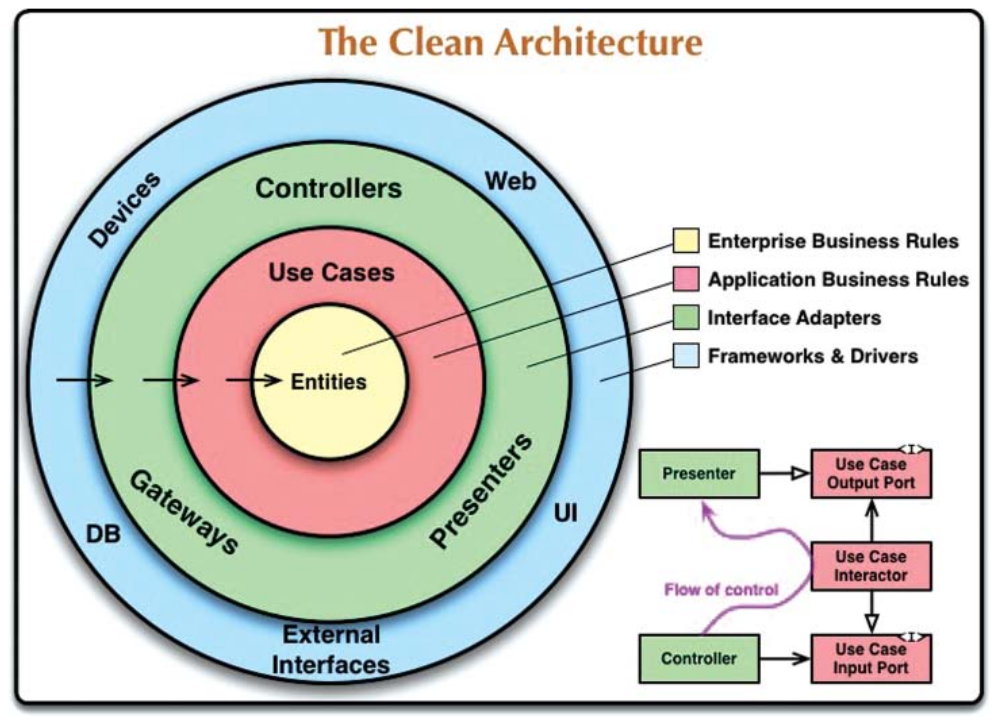

# GALT - Global Alliance for Libertarian Transformation

## Development

1. Start repl server
  - `clojure -Sdeps '{:deps {nrepl/nrepl {:mvn/version "1.3.1"}}}' -M:repl:dev -m nrepl.cmdline`
  - `clojure -M:dev:repl -m galt.main`
2. Connect to the nREPL server
  - from Vim: `:ConjureConnect`
  - or connect via REPL command line client: `clojure -T:nrebel :port 7888`
3. Start the system by evaluating in REPL
  - `(galt.main/start-system!)`
4. Open the page at http://localhost:8081

## Release & deployment

1. (local) Build a uberjar `clj -T:build uber`
2. (local) Copy it to the destination server: `scp target/galt-0.1.1-standalone.jar galt.is:~/www/galt.is`
  - also copy config files: `scp -r config galt.is:~/galt.is`
3. Remote env setup
  - create a database user: `CREATE ROLE galt PASSWORD 'galtpass' WITH SUPERUSER CREATEDB INHERIT LOGIN;`
    - _superuser is needed for some DB migrations that add extensions (e.g. cube, earthdistance)_
  - env variables needed: `MIGRATUS_DATABASE`, `MIGRATUS_USER`, `MIGRATUS_PASSWORD`
  - export env variables: `set -a && source .env && set +a`
4. (remote) Import geographical data (world.sql)
  - source: https://github.com/dr5hn/countries-states-cities-database/tree/master/psql
  - raw:  https://github.com/dr5hn/countries-states-cities-database/raw/refs/heads/master/psql/world.sql
  - it will be picked up by migration script `import-cities-countries` at
    `GALT_CITIES_COUNTRIES_SQL_PATH`
5. (remote) Run the database migrations
  - just the first time: `java -jar galt-0.1.1-standalone.jar init`
  - every time (when database changes) `java -jar galt-0.1.1-standalone.jar migrate`
6. (remote) Run the web server: `java -jar target/galt-0.1.1-standalone.jar`

## Architecture

The architecture of this project is based on Robert C. Martin's (Uncle Bob) Clean Architecture.


### Folder structure

The folders (Clojure namespaces) under `/src` are organized into groups of use cases to follow the [screaming architecture](https://blog.cleancoder.com/uncle-bob/2011/09/30/Screaming-Architecture.html) approach. Most use cases have the following sub-divisions:
```
src
└── galt
    ├── core
    │   ├── adapters
    │   │   ├── handlers.clj
    │   │   ├── sse_helpers.clj
    │   │   └── view_models.clj
    │   ├── domain
    │   ├── infrastructure
    │   │   ├── bitcoin
    │   │   │   ├── bouncy_castle_verify.clj
    │   │   │   ├── encoding.clj
    │   │   │   └── lnurl.clj
    │   │   ├── database.clj
    │   │   ├── database_migrations.clj
    │   │   ├── logging.clj
    │   │   ├── name_generator.clj
    │   │   └── web
    │   │       ├── helpers.clj
    │   │       ├── routes.clj
    │   │       └── server.clj
    │   ├── presentation
    │   │   ├── landing_page.clj
    │   │   └── layout.clj
    │   └── system.clj
    ├── groups
    │   ├── adapters
    │   │   ├── handlers.clj
    │   │   ├── in_memory_group_repository.clj
    │   │   ├── view_models.clj
    │   │   └── views.clj
    │   └── domain
    │       ├── entities
    │       │   └── group.clj
    │       ├── group_repository.clj
    │       └── use_cases
    │           └── add_group.clj
    ├── main.clj
    └── members
        ├── adapters
        │   ├── db_user_repository.clj
        │   ├── handlers.clj
        │   └── views.clj
        ├── domain
        │   └── user_repository.clj
        └── use_cases
            └── create_lightning_user.clj
```

